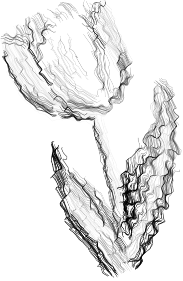
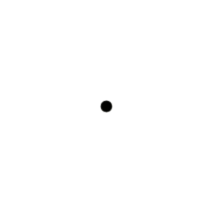

# Minimal: A Python, Generative Art Framework

Minimal is a Python Generative Art Framework that allows users to explore and create art using basic Computer Graphics (Cairo), Computer Vision (OpenCV), and Machine Learning (Torch). Make your own minimal art by following the documentation [here!](https://minimal-art.readthedocs.io/en/latest/)




## Roadmap
- [X] Graphics Framework (Canvas, Frames, Shapes, Objects)
- [ ] OpenCV Compatibility (VideoCapture, Edge Detection, 3D Rotation Matrix)
- [ ] Torch Compatibility (Image-to-Image, Neural Style Transfer, Image Interpolation)

## Get Started
```python
from minimal.display import Canvas
from minimal.shapes import Circle

canvas = Canvas(500, 500)

circle = Circle(250, 250, 1)
circle.transform(radius=[i for i in range(100)])

canvas.add(circle)
canvas.show()
```

